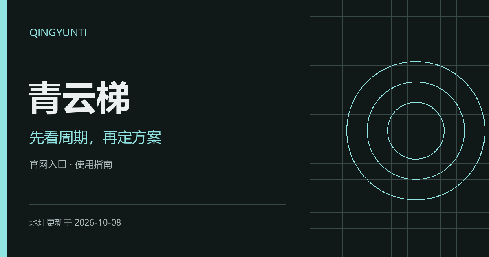

# 青雲梯機場官網入口｜VPN套餐週期與續費 **（更新於2026-10-10）**

[简体中文](README.md) · **繁體中文** · [English](README.en.md) · [日本語](README.ja.md) · [한국어](README.ko.md) · [Русский](README.ru.md)

本專案由青雲梯官方釋出與維護。青雲梯機場（QingYunTi）官方入口與VPN套餐指南：付款週期、流量重置、續費條件與地區選擇，附可直接閱讀的入口頁面。 青雲梯加速器的方案比較，應從實付金額、重置時間和到期時間開始。

**地址更新於 2026-10-10（北京時間）**

[官網入口](#official-addresses) · [使用步驟](#usage-guide) · [術語與接入方式](#connection-terms) · [常見問題](#brand-faq)

## QingYunTi · 青雲梯機場官方地址

| 入口 | 訪問地址 |
| --- | --- |
| 入口 1 | [qingyunjc.com](https://qingyunjc.com/) |
| 入口 2 | [qingyuntijsq.com](https://qingyuntijsq.com/) |
| 入口 3 | [qingyuntigw.com](https://qingyuntigw.com/) |
| 入口 4 | [qingyuntivpn.com](https://qingyuntivpn.com/) |

以上鍊接是網站入口，供訪問服務資訊與管理賬戶使用；它們不是個人訂閱連結，也不是代理節點。多個域名可能連線同一賬戶服務，不代表獨立備用線路或速度差異。

## 讓套餐週期與使用計劃一致

青雲梯的選購指南圍繞付款週期、流量重置和優惠有效期展開。把這三項放在同一張清單中，可以更清楚地區分短期試用與持續使用的成本。

### 1. 分清支付和重置週期

季付或年付描述的是付款方式，流量可能按月重置。下單前分別記錄付款覆蓋時長、每次額度與重置時間。

### 2. 先驗證常用地區

在你真正使用的時段檢查目標地區的網頁、影片或工作應用。節點地區多，並不意味著每個地區對你的網路都同樣合適。

### 3. 優惠按訂單計算

比較折扣後的實付金額、可用套餐和續費條件。過期活動不應成為今天下單的依據。

## 青雲梯：機場套餐與 VPN 加速器，應該比較哪些條件？

VPN 通常指虛擬專用網路；本指南中的“機場”指訂閱代理服務，“加速器”是更寬泛的軟體或服務稱呼，具體接入能力以賬戶文件為準。

“科學上網”和“魔法”是網路訪問場景中的常見俗稱，不是固定協議、獨立套餐或速度保證。

把實付金額、付款週期、流量重置和到期時間放在一起比較。一次性付款不必然表示無限期使用，折算月價也不必然表示可以按月購買。

## 使用體驗如何檢查

把地區、運營商、時段、客戶端版本和目標應用保持一致，再比較連線結果。持續訪問、下載峰值和應用地區識別是不同指標；失敗或超時也應記錄。本文未釋出本次實測速度或實時節點狀態。

可在自己的裝置上記錄以下資訊，向賬戶支援反饋時隱藏個人憑據：

| 記錄項 | 填寫方式 |
| --- | --- |
| 裝置與網路 | 系統、客戶端版本、運營商及 Wi-Fi／移動資料 |
| 當前配置 | 節點名稱、訂閱更新時間，不記錄金鑰 |
| 具體場景 | 應用名稱、操作步驟與觀察到的結果 |
| 發生時間 | 註明日期、時間及所在時區 |

## 青雲梯常見問題

### 年付等於一年流量一次到賬嗎？

不一定。應在訂單中找每月流量、總流量和重置規則，只有明確標註總量的方案才按總量理解。

### 線路名稱寫專線就能保證速度嗎？

線路型別與個人實際體驗是兩個問題，還需結合本地頻寬、運營商、時段以及套餐上限判斷。

### 當前套餐價格與活動在哪裡確認？

進入賬戶檢視當前訂單，核對實付金額、付款週期、流量重置、有效期、裝置限制與售後條件。歷史截圖和舊優惠碼不能代替當前交易條款。

## 使用本倉庫的入口網頁

`index.html` 提供青雲梯入口導航、完整域名、複製按鈕、操作指南和閱讀確認清單。可在本地開啟，也可將本目錄放在靜態 Web 伺服器上使用；頁面無需構建，不收集賬戶資訊，不自動跳轉。倉庫推送本身不會部署網站。

## 更新與反饋

地址或文件有誤，可在本倉庫提交 Issue，附上域名、發生時間與頁面提示。登入、訂單和付款問題請透過賬戶頁面的支援渠道處理。不要公開密碼、支付資訊或個人訂閱連結。更新日期隨地址清單的實際變更維護，不按訪問或構建自動重新整理。
